<p align="center">
  <a href="" rel="noopener">
 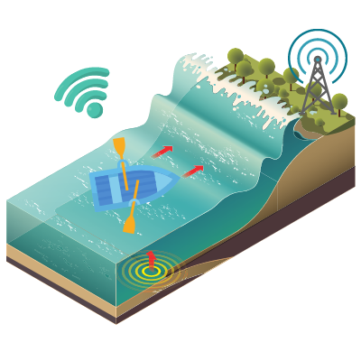</a>
</p>

<h3 align="center">RowMate</h3>

<div align="center">

[]()


</div>

---


<p align="center"> RowMate
    <br> 
</p>

## 📝 Table of Contents

- [About](#about)
- [Getting Started](#getting_started)
- [Prerequisites](#deployment)
- [Installation and Config](#Installation_and_Config)
- [Test](#test)
- [Circuit](#circuit)
- [Smartphone App](#app)
- [Built Using](#built_using)
- [Authors](#authors)

## 🧐 About <a name = "about"></a>

This repo contains circuit, firmware, app and backend for RowMate Project.

## 🏁 Getting Started <a name = "getting_started"></a>

These instructions will get you a copy of the project up and running on your local machine for development and testing purposes. See [deployment](#deployment) for notes on how to deploy the project on a live system.

### Prerequisites <a name = "Prerequisites"></a>

What things you need to install the software and how to install them.

```
- Android Smartphone
- Raspberry Pi Model 3B, 3B+, 4B or CM4
```

## Installation and Configuration <a name = "Installation_and_Config"></a>

A step by step series that covers how to get the Firmware and App running

### Raspberry Pi Firmware Pre-Reqs

1.  Download and install the latest Raspberry Pi OS Desktop image to your SD card
2.  Open the terminal and execute the following command
    ```sudo raspi-config```
3. Then follow the following pictures to enable I2C bus on you raspberry pi

* 
* 
* 
* 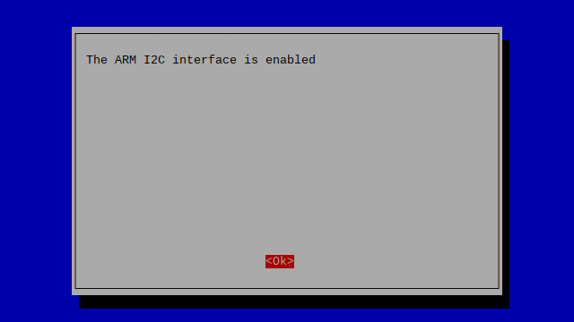
* 

* Then do the same for Serial(UART)

* 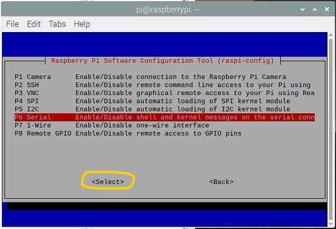

### Configuring Raspberry Pi and Running the UI
  1.  Copy Firmware folder to the desktop of your Raspberry Pi, open the terminal of your Raspberry Pi and execute the following commands

  - ```sudo apt-get update```
  - ```sudo apt-get upgrade```
  - ```sudo apt install python3-pip```
  - ```sudo pip3 install qrcode```
  - ```sudo pip3 install adafruit-circuitpython-lis3dh```
  - ```sudo pip3 install adafruit-circuitpython-bno055```
  - ```sudo pip3 install adafruit-circuitpython-gps```
  - ```cd ~/Desktop/Firmware```
  - ```sudo chmod a+rx starter.sh```
  - ```sudo chmod a+rx getControllerID.sh```

2.  To run the program just double click on starter.sh file
  1.  or execute `python3 /home/pi/Desktop/Firmware/Firmware.py`


```diff
  + make sure that the BLE of raspeberry pi is turned on. Pairing is not required.
  + Please note that the program will auto adjust itself to the screen size of HDMI Screen
```

### Screenshots of RowMate UI
* Below are the screenshots of RowMate UI running on the Raspberry Pi and being displayed on a HDMI Screen.

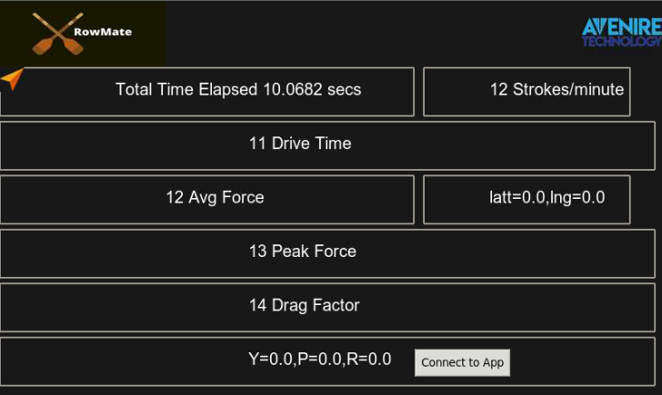
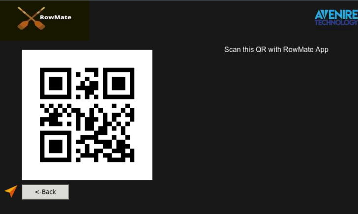

## ⛏️ Testing <a name = "test"></a>

1.  The Firmware can be tested on Raspberry Pi 3B, 3B+ or 4B with the following modifications
  1.  In btnHandler.py file change the GPIOs to the correct GPIOs based on the GPIOs pinout given in the Circuit Diagram section below.

## 🔌 Circuit Diagram <a name = "circuit"></a>

* CM4 GPIOs Pinout

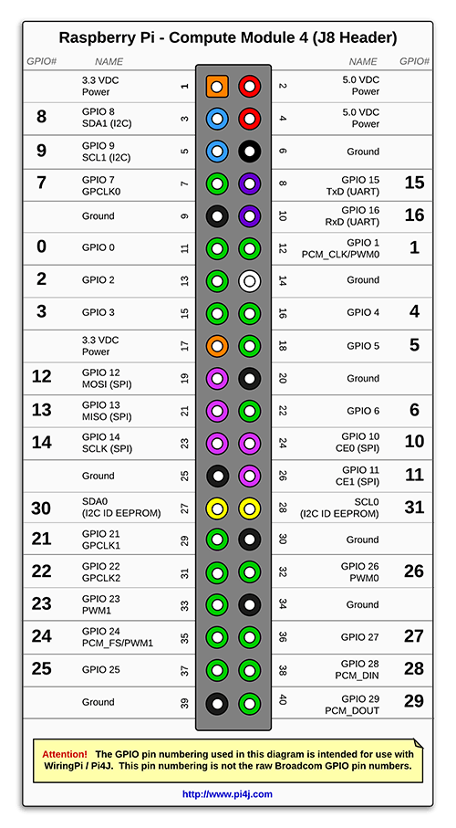

* RPi 3,4 GPIOs Pinout(for prototype)

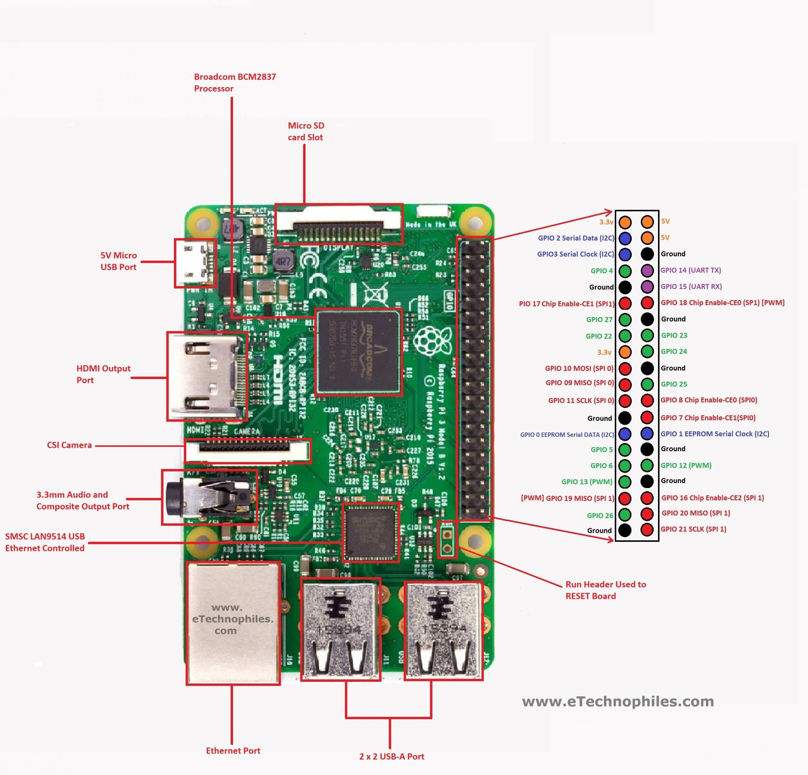


## 📱 Smartphone App <a name = "App"></a>

* Compiled App is availble in the following directory of this repo

`App/RowMate/RowMateApp/build/app/outputs/apk/release/`

1.  Install the RowMate App
2.  Open the app and it will ask for the Bluetooth and Location premissons. Turn on your smartphone's location and bluetooth and allow the permissions in the app.
3.  Run the Firmware on the Raspberry Pi as explained in the 'Configuring Raspberry Pi and Running the UI' section above.
4.  On the UI, move the cursor by pressing Up and Down buttons and once the cursor is on 'Connect to App' button, press Enter button and it will display a QR Code.
2.  On your smartphone app click on 'Scan and Connect' button and scan the QR Code being displayed on your screen connected with the Raspberry Pi. The RowMate app will connect to the Raspberry Pi and it is now ready to be used.

### Screenshots of App

* Here are some screenshots of the RowMate smartphone app

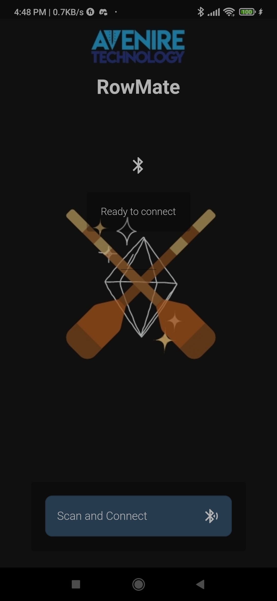
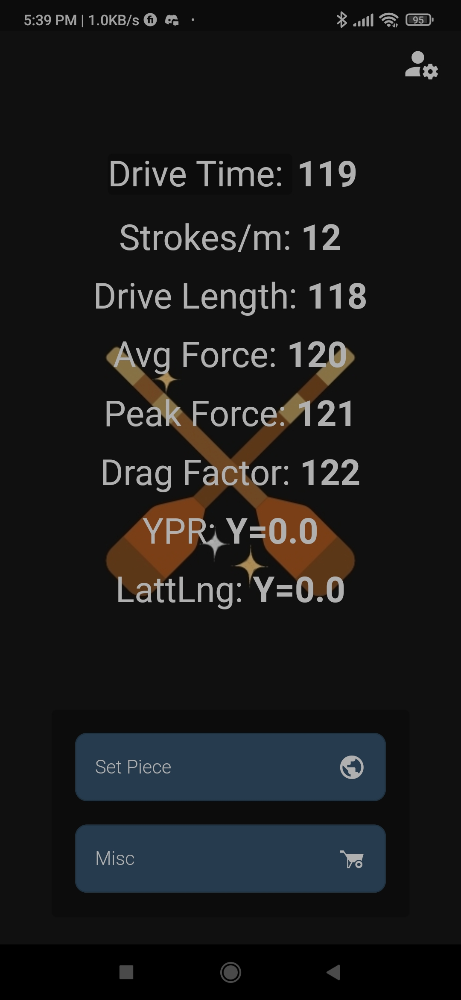
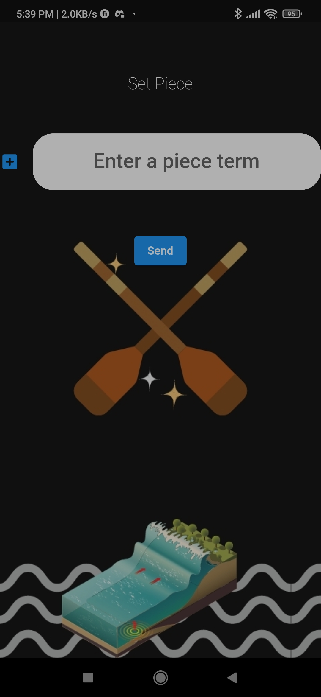
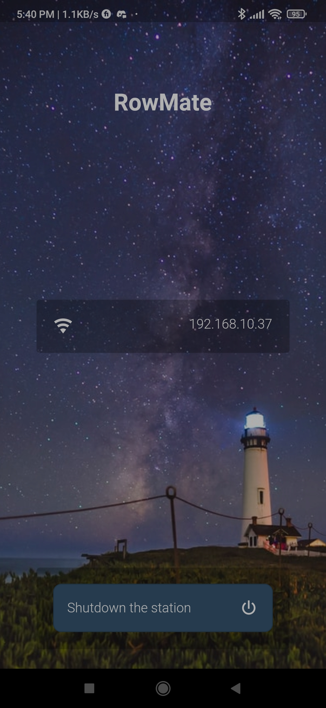


## Demo Video

  
  - [Demo Video](https://youtu.be/v5-WBKudcoc) - RowMate Demo Video
## ⛏️ Built Using <a name = "built_using"></a>

- [Python3](https://www.python.org/) - Raspberry Pi FW
- [Flutter](https://flutter.dev/) - Cross-Platform Smartphone App Development Framework

## ✍️ Authors <a name = "authors"></a>

- [@Nauman3S](https://github.com/Nauman3S) - Development and Deployment
